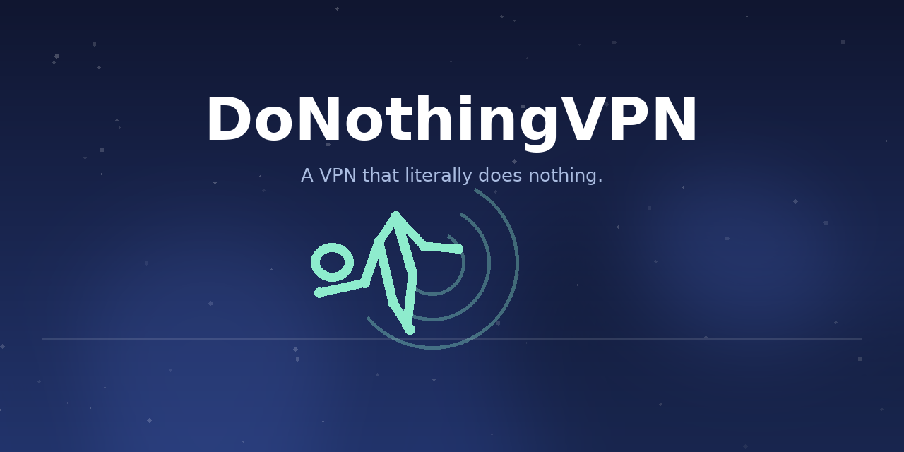

<p align="center">
  
</p>

<h1 align="center">DoNothingVPN</h1>

<p align="center">
  <a href="README.zh-CN.md"></a>
  
  
  
</p>

<p align="center"><strong>A tiny fake VPN that connects, then does absolutely nothing.</strong></p>

## What is it

A small Android app that shows a *connected VPN* notification — without routing a single byte.
It is a **placebo VPN**: perfect for apps or settings that demand an active VPN connection
while you stay in full control of your traffic.

## Features

- **Real fake VPN** — calls `VpnService.prepare()`, then builds an empty tunnel.
- **Persistent status** — a "connected" notification stays in your status bar.
- **Rename & repackage** — change the app (and VPN) name on the fly; it re-signs the APK
  with your own key and reinstalls it.
- **Lightweight** — zero permissions beyond asking to become a VPN.

## How it works

The foreground service opens an `android.net.VpnService` and hands an empty builder back
to the system. Android then shows the VPN-connection icon and notification — nothing more,
nothing less. `Repackager.kt` rewrites the app label in `AndroidManifest.xml`, re-signs the
APK, and the installed copy keeps its identity — including the VPN name shown in the status bar.

## Build

```bash
gradle assembleDebug assembleRelease --no-daemon
```

The debug APK is signed with `keystore/repack.p12`. If `keystore-local.properties` is missing,
the build falls back to the defaults (`android` / `repack`). Keep both out of version control.

CI rebuilds both variants on every push and uploads them as workflow artifacts.

## Why "Do Nothing"?

Some connections are better left unconnected. This one just looks the part.

---

<p align="center">
  <a href="README.zh-CN.md">简体中文版</a>
</p>